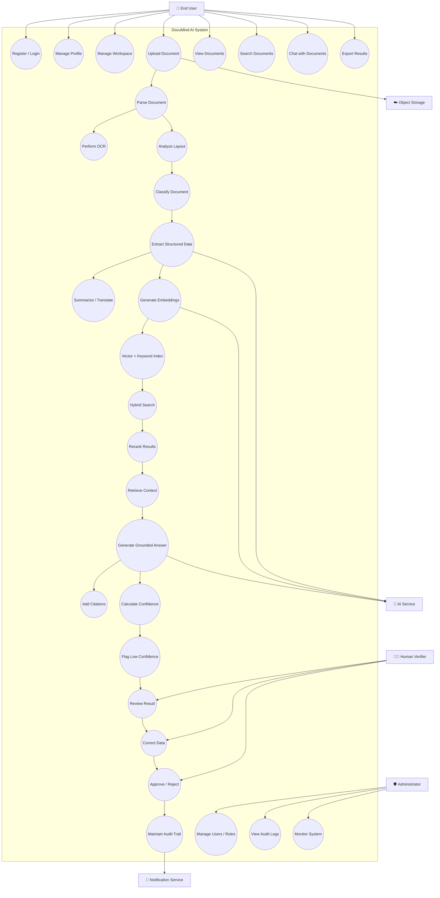
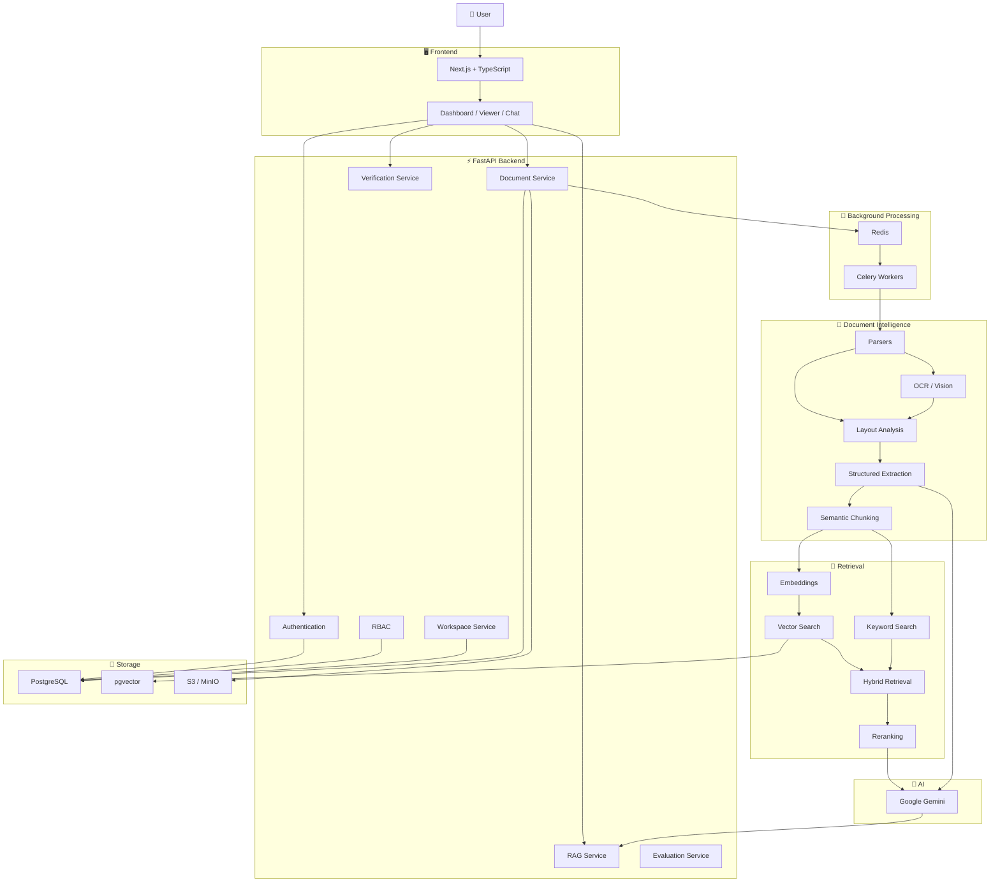
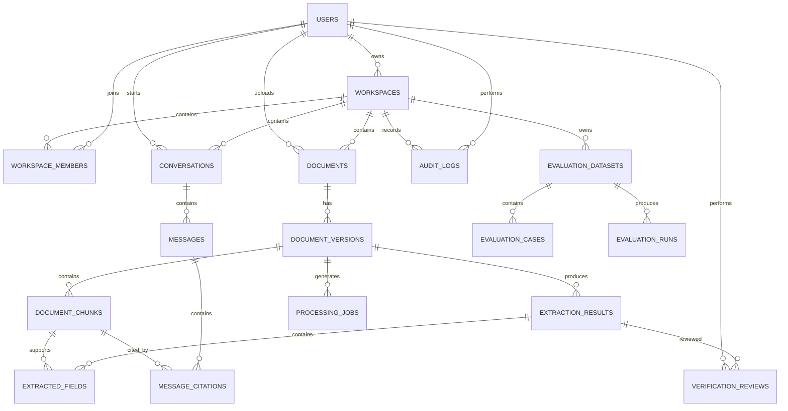
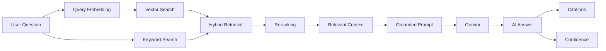
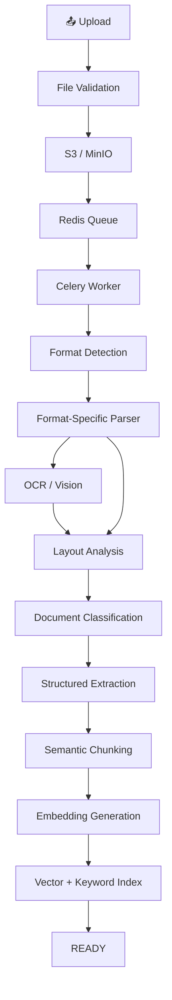
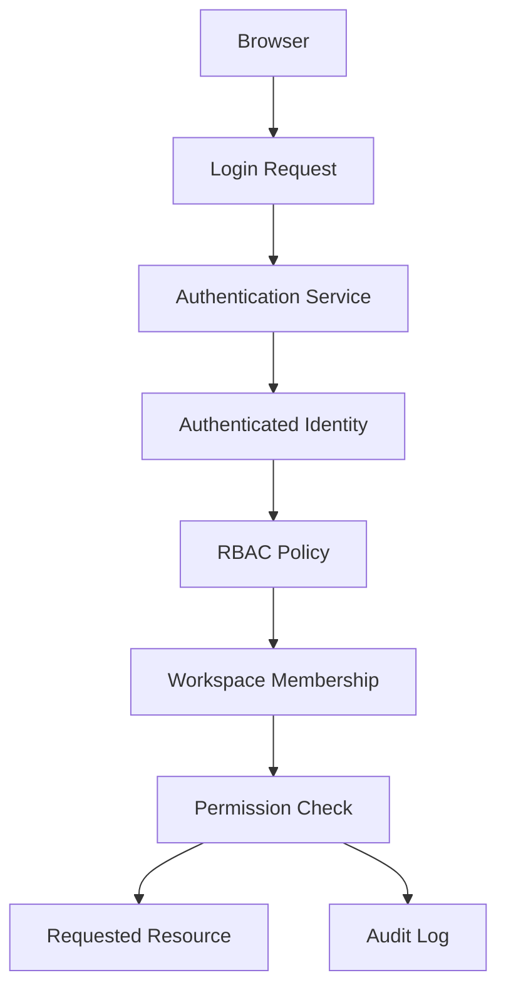
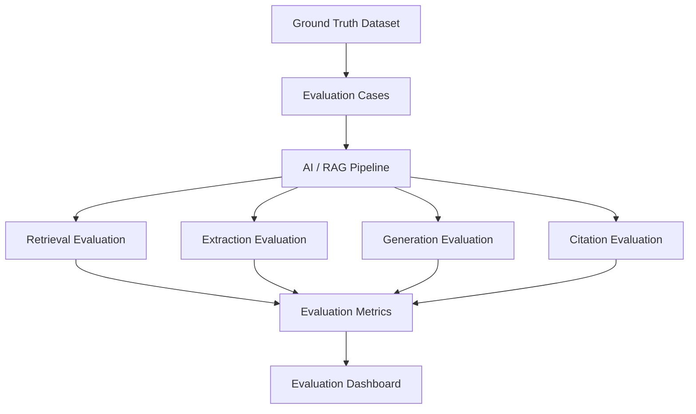
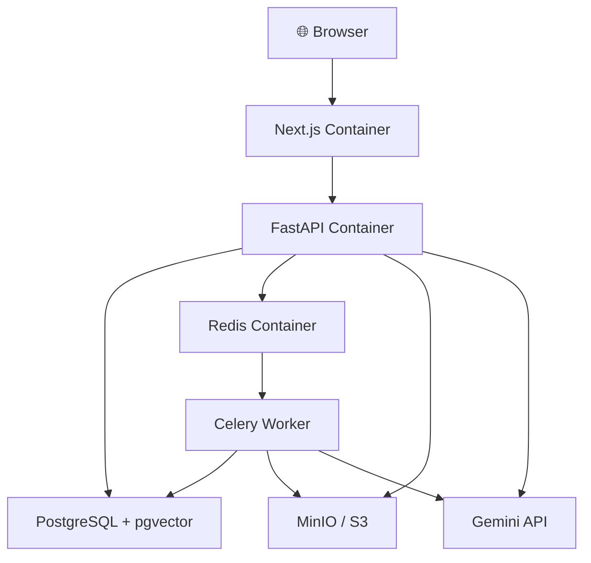

# 🧠 DocuMind AI

### Secure AI-Powered Document Intelligence, RAG & Verification Platform

> **DocuMind AI** is a full-stack AI document intelligence platform that transforms unstructured documents into searchable, structured, explainable and verifiable knowledge using multi-format parsing, OCR, RAG, hybrid search, AI extraction, citations, confidence scoring and human-in-the-loop verification.

---

<p align="center">

**🔐 Secure & Multi-Tenant**
**📄 Multi-Format Intelligence**
**🔎 Hybrid RAG Search**
**🤖 AI-Powered Extraction**
**📚 Evidence-Based Citations**
**✅ Human Verification**
**📊 AI Evaluation**

</p>

---

## 📌 Table of Contents

1. [Final Requirements](#1-final-requirements)
2. [Use-Case Diagram](#2-use-case-diagram)
3. [System Architecture](#3-system-architecture)
4. [Database ER Diagram](#4-database-er-diagram)
5. [Complete Database Schema](#5-complete-database-schema)
6. [API Specification](#6-api-specification)
7. [RAG Architecture](#7-rag-architecture)
8. [Document-Processing Pipeline](#8-document-processing-pipeline)
9. [Authentication / RBAC Architecture](#9-authentication--rbac-architecture)
10. [AI Evaluation Architecture](#10-ai-evaluation-architecture)
11. [Frontend Page Structure](#11-frontend-page-structure)
12. [Backend Folder Structure](#12-backend-folder-structure)
13. [Docker Architecture](#13-docker-architecture)
14. [Development Milestones](#14-development-milestones)
15. [Testing Strategy](#15-testing-strategy)

---

# 1. Final Requirements

## 1.1 Project Objective

The objective of DocuMind AI is to build a **production-oriented document intelligence system** capable of understanding heterogeneous documents and providing users with structured information and evidence-grounded answers.

The system must move beyond simple document parsing and provide:

```text
Document
   ↓
Understand
   ↓
Structure
   ↓
Index
   ↓
Retrieve
   ↓
Reason
   ↓
Cite
   ↓
Verify
   ↓
Evaluate
```

---

## 1.2 Core Functional Requirements

### FR-01 — User Authentication

The system shall provide:

* User registration.
* Secure login.
* Logout.
* Password reset.
* Account verification.
* Profile management.
* Session/token management.

---

### FR-02 — Role-Based Access Control

The system shall support:

| Role     | Access                                    |
| -------- | ----------------------------------------- |
| `OWNER`  | Complete workspace control                |
| `ADMIN`  | Users, documents, settings and management |
| `MEMBER` | Upload, process, search and chat          |
| `VIEWER` | Read-only access                          |

---

### FR-03 — Workspace Management

Users shall be able to:

* Create workspaces.
* Switch workspaces.
* Invite members.
* Assign roles.
* Remove members.
* Manage workspace settings.

Every document, conversation and evaluation dataset belongs to a workspace.

---

### FR-04 — Multi-Format Upload

The system shall support:

```text
PDF
DOCX
PPTX
XLSX
CSV
TXT
MD
JSON
PNG
JPG / JPEG
WEBP
```

---

### FR-05 — Secure Document Storage

Original files shall be stored in secure object storage such as:

```text
Amazon S3
MinIO
```

The database stores metadata and storage references rather than relying on local browser storage.

---

### FR-06 — Intelligent Document Processing

The system shall support:

* Text extraction.
* OCR.
* Layout analysis.
* Table extraction.
* Metadata extraction.
* Image extraction.
* Document classification.
* Structured information extraction.

---

### FR-07 — AI Understanding

The system shall provide:

* Document classification.
* Summarization.
* Translation.
* Key-point extraction.
* Risk identification.
* Action-item extraction.
* Structured field extraction.

---

### FR-08 — RAG

The system shall support:

* Semantic chunking.
* Embeddings.
* Vector search.
* Keyword search.
* Hybrid retrieval.
* Reranking.
* Grounded answer generation.

---

### FR-09 — Citations

AI-generated answers shall expose supporting evidence:

```text
Document
   ↓
Page
   ↓
Section
   ↓
Chunk
   ↓
Source Text
```

---

### FR-10 — Confidence Scoring

The system shall calculate confidence using measurable signals such as:

* Evidence availability.
* Retrieval relevance.
* Schema validation.
* Source consistency.
* Extraction agreement.
* Historical evaluation performance.

---

### FR-11 — Human Verification

Low-confidence results shall be eligible for human review.

Reviewers shall be able to:

* View source evidence.
* Edit extracted fields.
* Approve results.
* Reject results.
* Add reviewer notes.

---

### FR-12 — Audit Trail

Important operations shall be recorded:

```text
LOGIN
UPLOAD
ACCESS
DELETE
EXTRACTION
VERIFICATION
APPROVAL
REJECTION
ROLE_CHANGE
WORKSPACE_CHANGE
```

---

### FR-13 — Document Versioning

Documents shall support:

```text
Version 1
Version 2
Version 3
...
```

This enables future document comparison and version-aware RAG.

---

### FR-14 — AI Evaluation

The system shall evaluate:

* Extraction accuracy.
* Retrieval quality.
* Answer relevance.
* Faithfulness.
* Citation accuracy.
* Hallucination rate.

---

## 1.3 Non-Functional Requirements

| Requirement     | Goal                                 |
| --------------- | ------------------------------------ |
| Security        | Protect users, files and credentials |
| Reliability     | Handle failures and retries          |
| Scalability     | Support increasing documents/users   |
| Maintainability | Modular codebase                     |
| Extensibility   | Add formats/models/providers         |
| Explainability  | Evidence-backed AI                   |
| Auditability    | Track important operations           |
| Testability     | Automated testing                    |
| Performance     | Async processing and caching         |
| Privacy         | Minimize unnecessary data exposure   |

---

## 1.4 Security Requirements

The system must provide:

* Server-side API credentials.
* Secure authentication.
* Password hashing.
* RBAC.
* Workspace isolation.
* File validation.
* Rate limiting.
* HTTPS/TLS.
* Encryption at rest where supported.
* Audit logging.
* Prompt-injection protection.
* Input validation.

Uploaded documents must always be treated as **untrusted data**.

---

## 1.5 MVP Boundary

### Must Have

```text
Authentication
RBAC
Workspaces
Secure Upload
Multi-format Parsing
OCR
Structured Extraction
Gemini Integration
PostgreSQL
pgvector
Semantic Chunking
Embeddings
Hybrid Search
RAG
Citations
Confidence Scoring
Human Verification
Audit Trail
AI Evaluation
```

### Later Enhancements

```text
Advanced document comparison
Real-time collaboration
Multiple AI providers
Advanced OCR
Enterprise SSO
Fine-tuned models
Large-scale distributed processing
```

---

# 2. Use-Case Diagram



---

# 3. System Architecture

DocuMind AI follows a **modular monolith + asynchronous worker architecture**.



---

## Architecture Flow

```text
User
 ↓
Next.js
 ↓
FastAPI
 ↓
Authentication + RBAC
 ↓
Secure Upload
 ↓
S3 / MinIO
 ↓
Redis
 ↓
Celery Worker
 ↓
Parser + OCR + Layout Analysis
 ↓
Structured Document
 ↓
Chunking
 ↓
Embeddings
 ↓
PostgreSQL + pgvector
 ↓
Hybrid Search
 ↓
Reranking
 ↓
Gemini
 ↓
Grounded Answer
 ↓
Citation + Confidence
 ↓
Human Verification
 ↓
Final Result
```

---

# 4. Database ER Diagram



---

# 5. Complete Database Schema

## 5.1 Schema Overview

| Domain        | Tables                                                       |
| ------------- | ------------------------------------------------------------ |
| Identity      | `users`                                                      |
| Workspace     | `workspaces`, `workspace_members`                            |
| Documents     | `documents`, `document_versions`                             |
| Processing    | `processing_jobs`                                            |
| RAG           | `document_chunks`                                            |
| Extraction    | `extraction_results`, `extracted_fields`                     |
| Conversations | `conversations`, `messages`                                  |
| Citations     | `message_citations`                                          |
| Verification  | `verification_reviews`                                       |
| Audit         | `audit_logs`                                                 |
| Evaluation    | `evaluation_datasets`, `evaluation_cases`, `evaluation_runs` |

---

## 5.2 Users

```sql
CREATE TABLE users (
    id UUID PRIMARY KEY DEFAULT gen_random_uuid(),

    email VARCHAR(255) NOT NULL UNIQUE,

    password_hash TEXT,

    full_name VARCHAR(150) NOT NULL,

    is_active BOOLEAN NOT NULL DEFAULT TRUE,

    is_verified BOOLEAN NOT NULL DEFAULT FALSE,

    created_at TIMESTAMPTZ NOT NULL DEFAULT NOW(),

    updated_at TIMESTAMPTZ NOT NULL DEFAULT NOW()
);
```

---

## 5.3 Workspaces

```sql
CREATE TABLE workspaces (
    id UUID PRIMARY KEY DEFAULT gen_random_uuid(),

    name VARCHAR(150) NOT NULL,

    owner_id UUID NOT NULL
        REFERENCES users(id)
        ON DELETE RESTRICT,

    created_at TIMESTAMPTZ NOT NULL DEFAULT NOW(),

    updated_at TIMESTAMPTZ NOT NULL DEFAULT NOW()
);
```

---

## 5.4 Workspace Members

```sql
CREATE TABLE workspace_members (
    id UUID PRIMARY KEY DEFAULT gen_random_uuid(),

    workspace_id UUID NOT NULL
        REFERENCES workspaces(id)
        ON DELETE CASCADE,

    user_id UUID NOT NULL
        REFERENCES users(id)
        ON DELETE CASCADE,

    role VARCHAR(20) NOT NULL,

    joined_at TIMESTAMPTZ NOT NULL DEFAULT NOW(),

    CONSTRAINT valid_workspace_role
        CHECK (
            role IN ('OWNER', 'ADMIN', 'MEMBER', 'VIEWER')
        ),

    UNIQUE (workspace_id, user_id)
);
```

---

## 5.5 Documents

```sql
CREATE TABLE documents (
    id UUID PRIMARY KEY DEFAULT gen_random_uuid(),

    workspace_id UUID NOT NULL
        REFERENCES workspaces(id)
        ON DELETE CASCADE,

    uploaded_by UUID NOT NULL
        REFERENCES users(id)
        ON DELETE RESTRICT,

    filename VARCHAR(500) NOT NULL,

    file_type VARCHAR(20) NOT NULL,

    file_size BIGINT NOT NULL,

    checksum VARCHAR(128),

    status VARCHAR(30) NOT NULL DEFAULT 'UPLOADED',

    document_type VARCHAR(50),

    storage_key TEXT NOT NULL,

    metadata JSONB DEFAULT '{}'::jsonb,

    created_at TIMESTAMPTZ NOT NULL DEFAULT NOW(),

    updated_at TIMESTAMPTZ NOT NULL DEFAULT NOW(),

    CHECK (
        status IN (
            'UPLOADED',
            'QUEUED',
            'PROCESSING',
            'EXTRACTED',
            'INDEXING',
            'READY',
            'FAILED'
        )
    )
);
```

---

## 5.6 Document Versions

```sql
CREATE TABLE document_versions (
    id UUID PRIMARY KEY DEFAULT gen_random_uuid(),

    document_id UUID NOT NULL
        REFERENCES documents(id)
        ON DELETE CASCADE,

    version_number INTEGER NOT NULL,

    storage_key TEXT NOT NULL,

    processing_status VARCHAR(30) NOT NULL,

    checksum VARCHAR(128),

    created_at TIMESTAMPTZ NOT NULL DEFAULT NOW(),

    UNIQUE (document_id, version_number)
);
```

---

## 5.7 Document Chunks

```sql
CREATE TABLE document_chunks (
    id UUID PRIMARY KEY DEFAULT gen_random_uuid(),

    document_version_id UUID NOT NULL
        REFERENCES document_versions(id)
        ON DELETE CASCADE,

    chunk_index INTEGER NOT NULL,

    content TEXT NOT NULL,

    page_number INTEGER,

    section TEXT,

    metadata JSONB DEFAULT '{}'::jsonb,

    embedding VECTOR(1536),

    created_at TIMESTAMPTZ NOT NULL DEFAULT NOW(),

    UNIQUE (document_version_id, chunk_index)
);
```

Recommended vector index:

```sql
CREATE INDEX idx_document_chunks_embedding
ON document_chunks
USING hnsw (embedding vector_cosine_ops);
```

> `1536` is an example embedding dimension. The production value must match the selected embedding model.

---

## 5.8 Extraction Results

```sql
CREATE TABLE extraction_results (
    id UUID PRIMARY KEY DEFAULT gen_random_uuid(),

    document_version_id UUID NOT NULL
        REFERENCES document_versions(id)
        ON DELETE CASCADE,

    extraction_type VARCHAR(100) NOT NULL,

    extracted_data JSONB NOT NULL,

    confidence_score NUMERIC(5,4),

    status VARCHAR(30) NOT NULL DEFAULT 'PENDING',

    created_at TIMESTAMPTZ NOT NULL DEFAULT NOW(),

    CHECK (
        confidence_score IS NULL
        OR confidence_score BETWEEN 0 AND 1
    )
);
```

---

## 5.9 Extracted Fields

```sql
CREATE TABLE extracted_fields (
    id UUID PRIMARY KEY DEFAULT gen_random_uuid(),

    extraction_result_id UUID NOT NULL
        REFERENCES extraction_results(id)
        ON DELETE CASCADE,

    field_name VARCHAR(200) NOT NULL,

    field_value TEXT,

    confidence_score NUMERIC(5,4),

    source_chunk_id UUID
        REFERENCES document_chunks(id)
        ON DELETE SET NULL,

    created_at TIMESTAMPTZ NOT NULL DEFAULT NOW(),

    CHECK (
        confidence_score IS NULL
        OR confidence_score BETWEEN 0 AND 1
    )
);
```

---

## 5.10 Processing Jobs

```sql
CREATE TABLE processing_jobs (
    id UUID PRIMARY KEY DEFAULT gen_random_uuid(),

    document_version_id UUID NOT NULL
        REFERENCES document_versions(id)
        ON DELETE CASCADE,

    job_type VARCHAR(50) NOT NULL,

    status VARCHAR(30) NOT NULL,

    retry_count INTEGER NOT NULL DEFAULT 0,

    error_message TEXT,

    started_at TIMESTAMPTZ,

    completed_at TIMESTAMPTZ,

    created_at TIMESTAMPTZ NOT NULL DEFAULT NOW()
);
```

---

## 5.11 Conversations

```sql
CREATE TABLE conversations (
    id UUID PRIMARY KEY DEFAULT gen_random_uuid(),

    workspace_id UUID NOT NULL
        REFERENCES workspaces(id)
        ON DELETE CASCADE,

    user_id UUID NOT NULL
        REFERENCES users(id)
        ON DELETE RESTRICT,

    title VARCHAR(300),

    created_at TIMESTAMPTZ NOT NULL DEFAULT NOW(),

    updated_at TIMESTAMPTZ NOT NULL DEFAULT NOW()
);
```

---

## 5.12 Messages

```sql
CREATE TABLE messages (
    id UUID PRIMARY KEY DEFAULT gen_random_uuid(),

    conversation_id UUID NOT NULL
        REFERENCES conversations(id)
        ON DELETE CASCADE,

    role VARCHAR(20) NOT NULL,

    content TEXT NOT NULL,

    metadata JSONB DEFAULT '{}'::jsonb,

    created_at TIMESTAMPTZ NOT NULL DEFAULT NOW(),

    CHECK (
        role IN ('USER', 'ASSISTANT', 'SYSTEM')
    )
);
```

---

## 5.13 Message Citations

```sql
CREATE TABLE message_citations (
    id UUID PRIMARY KEY DEFAULT gen_random_uuid(),

    message_id UUID NOT NULL
        REFERENCES messages(id)
        ON DELETE CASCADE,

    document_chunk_id UUID NOT NULL
        REFERENCES document_chunks(id)
        ON DELETE CASCADE,

    page_number INTEGER,

    quoted_text TEXT,

    created_at TIMESTAMPTZ NOT NULL DEFAULT NOW()
);
```

---

## 5.14 Verification Reviews

```sql
CREATE TABLE verification_reviews (
    id UUID PRIMARY KEY DEFAULT gen_random_uuid(),

    extraction_result_id UUID NOT NULL
        REFERENCES extraction_results(id)
        ON DELETE CASCADE,

    reviewer_id UUID NOT NULL
        REFERENCES users(id)
        ON DELETE RESTRICT,

    status VARCHAR(30) NOT NULL,

    reviewer_notes TEXT,

    corrected_data JSONB,

    reviewed_at TIMESTAMPTZ,

    created_at TIMESTAMPTZ NOT NULL DEFAULT NOW(),

    CHECK (
        status IN (
            'PENDING',
            'APPROVED',
            'REJECTED',
            'CORRECTED'
        )
    )
);
```

---

## 5.15 Audit Logs

```sql
CREATE TABLE audit_logs (
    id UUID PRIMARY KEY DEFAULT gen_random_uuid(),

    user_id UUID
        REFERENCES users(id)
        ON DELETE SET NULL,

    workspace_id UUID
        REFERENCES workspaces(id)
        ON DELETE SET NULL,

    action VARCHAR(100) NOT NULL,

    resource_type VARCHAR(100),

    resource_id UUID,

    details JSONB DEFAULT '{}'::jsonb,

    ip_address INET,

    created_at TIMESTAMPTZ NOT NULL DEFAULT NOW()
);
```

---

## 5.16 Evaluation Tables

```sql
CREATE TABLE evaluation_datasets (
    id UUID PRIMARY KEY DEFAULT gen_random_uuid(),

    workspace_id UUID
        REFERENCES workspaces(id)
        ON DELETE CASCADE,

    name VARCHAR(200) NOT NULL,

    description TEXT,

    created_at TIMESTAMPTZ NOT NULL DEFAULT NOW()
);
```

```sql
CREATE TABLE evaluation_cases (
    id UUID PRIMARY KEY DEFAULT gen_random_uuid(),

    dataset_id UUID NOT NULL
        REFERENCES evaluation_datasets(id)
        ON DELETE CASCADE,

    question TEXT NOT NULL,

    expected_answer TEXT,

    expected_citations JSONB,

    created_at TIMESTAMPTZ NOT NULL DEFAULT NOW()
);
```

```sql
CREATE TABLE evaluation_runs (
    id UUID PRIMARY KEY DEFAULT gen_random_uuid(),

    dataset_id UUID NOT NULL
        REFERENCES evaluation_datasets(id)
        ON DELETE CASCADE,

    model_name VARCHAR(200) NOT NULL,

    accuracy NUMERIC(6,5),

    precision_score NUMERIC(6,5),

    recall_score NUMERIC(6,5),

    f1_score NUMERIC(6,5),

    retrieval_score NUMERIC(6,5),

    citation_accuracy NUMERIC(6,5),

    faithfulness NUMERIC(6,5),

    created_at TIMESTAMPTZ NOT NULL DEFAULT NOW()
);
```

---

# 6. API Specification

## 6.1 API Base

```text
Development:
http://localhost:8000/api/v1

Production:
https://<api-domain>/api/v1
```

FastAPI documentation:

```text
/api/docs
/api/redoc
/api/openapi.json
```

---

## 6.2 Authentication API

| Method | Endpoint                | Purpose        |
| ------ | ----------------------- | -------------- |
| `POST` | `/auth/register`        | Register       |
| `POST` | `/auth/login`           | Login          |
| `POST` | `/auth/logout`          | Logout         |
| `GET`  | `/auth/me`              | Current user   |
| `POST` | `/auth/forgot-password` | Password reset |
| `POST` | `/auth/reset-password`  | Reset password |

---

## 6.3 Workspace API

| Method   | Endpoint           | Purpose |
| -------- | ------------------ | ------- |
| `POST`   | `/workspaces`      | Create  |
| `GET`    | `/workspaces`      | List    |
| `GET`    | `/workspaces/{id}` | Get     |
| `PATCH`  | `/workspaces/{id}` | Update  |
| `DELETE` | `/workspaces/{id}` | Delete  |

---

## 6.4 Member API

| Method   | Endpoint                             | Purpose       |
| -------- | ------------------------------------ | ------------- |
| `GET`    | `/workspaces/{id}/members`           | List members  |
| `POST`   | `/workspaces/{id}/members`           | Add member    |
| `PATCH`  | `/workspaces/{id}/members/{user_id}` | Update role   |
| `DELETE` | `/workspaces/{id}/members/{user_id}` | Remove member |

---

## 6.5 Document API

| Method   | Endpoint                            | Purpose           |
| -------- | ----------------------------------- | ----------------- |
| `POST`   | `/workspaces/{id}/documents`        | Upload            |
| `GET`    | `/workspaces/{id}/documents`        | List              |
| `GET`    | `/documents/{id}`                   | Details           |
| `DELETE` | `/documents/{id}`                   | Delete            |
| `GET`    | `/documents/{id}/status`            | Processing status |
| `POST`   | `/documents/{id}/retry`             | Retry processing  |
| `POST`   | `/documents/{id}/analyze`           | Start analysis    |
| `GET`    | `/documents/{id}/extraction`        | Get extraction    |
| `GET`    | `/documents/{id}/extraction/fields` | Get fields        |

---

## 6.6 Search API

```http
GET /workspaces/{workspace_id}/search
```

Parameters:

```text
q
type
top_k
page
page_size
```

Search modes:

```text
KEYWORD
SEMANTIC
HYBRID
```

Example response:

```json
{
  "query": "termination clause",
  "results": [
    {
      "document_id": "uuid",
      "chunk_id": "uuid",
      "score": 0.91,
      "page": 8,
      "section": "Termination",
      "content": "..."
    }
  ]
}
```

---

## 6.7 RAG API

```http
POST /workspaces/{workspace_id}/conversations
```

```http
POST /conversations/{conversation_id}/messages
```

Example:

```json
{
  "question": "What is the termination period?",
  "document_ids": [
    "document-uuid"
  ],
  "top_k": 8
}
```

Response:

```json
{
  "message_id": "uuid",
  "answer": "The termination period is 30 days.",
  "confidence": 0.94,
  "citations": [
    {
      "document_id": "uuid",
      "page": 8,
      "section": "Termination",
      "chunk_id": "uuid"
    }
  ]
}
```

---

## 6.8 Verification API

| Method  | Endpoint                                | Purpose         |
| ------- | --------------------------------------- | --------------- |
| `POST`  | `/extractions/{id}/review`              | Create review   |
| `GET`   | `/workspaces/{id}/verification/pending` | Pending reviews |
| `PATCH` | `/verification/{id}`                    | Update review   |

---

## 6.9 Evaluation API

| Method | Endpoint                          | Purpose        |
| ------ | --------------------------------- | -------------- |
| `POST` | `/evaluation/datasets`            | Create dataset |
| `POST` | `/evaluation/datasets/{id}/cases` | Add case       |
| `POST` | `/evaluation/datasets/{id}/run`   | Run evaluation |
| `GET`  | `/evaluation/runs/{id}`           | Get results    |

---

## 6.10 Health API

```http
GET /health
```

```http
GET /health/ready
```

---

## 6.11 HTTP Status Codes

| Code  | Meaning                 |
| ----- | ----------------------- |
| `200` | Success                 |
| `201` | Created                 |
| `202` | Accepted / asynchronous |
| `204` | No content              |
| `400` | Bad request             |
| `401` | Unauthorized            |
| `403` | Forbidden               |
| `404` | Not found               |
| `409` | Conflict                |
| `413` | Payload too large       |
| `415` | Unsupported type        |
| `422` | Validation error        |
| `429` | Rate limited            |
| `500` | Server error            |
| `502` | External service error  |
| `503` | Service unavailable     |

---

# 7. RAG Architecture

DocuMind AI uses **Retrieval-Augmented Generation** to ground AI responses in user-provided documents.



---

## 7.1 RAG Pipeline

```text
User Query
 ↓
Query Processing
 ↓
Query Embedding
 ↓
Keyword Search + Vector Search
 ↓
Hybrid Retrieval
 ↓
Reranking
 ↓
Top Relevant Chunks
 ↓
Context Construction
 ↓
Grounded Prompt
 ↓
Gemini
 ↓
Answer
 ↓
Citations + Confidence
```

---

## 7.2 Semantic Chunking

Documents should not be blindly divided into fixed-size text blocks.

Chunking should consider:

* Headings.
* Paragraph boundaries.
* Tables.
* Page boundaries.
* Lists.
* Sections.
* Document structure.

Example:

```text
Document
 ├── Section
 │    ├── Paragraph
 │    ├── Paragraph
 │    └── Table
 │
 └── Section
      ├── Paragraph
      └── Paragraph
```

---

## 7.3 Hybrid Search

```text
             Query
               │
       ┌───────┴───────┐
       ↓               ↓
Keyword Search   Vector Search
       │               │
       └───────┬───────┘
               ↓
       Hybrid Retrieval
               ↓
           Reranking
               ↓
        Relevant Evidence
```

Hybrid search is particularly important for:

* Names.
* IDs.
* Dates.
* Contract clauses.
* Numbers.
* Technical terminology.

---

## 7.4 RAG Guardrails

The RAG system must:

* Prefer retrieved evidence.
* Reject unsupported claims.
* Preserve source references.
* Treat document instructions as untrusted.
* Detect insufficient evidence.
* Avoid fabricated citations.
* Separate system instructions from document content.

---

# 8. Document-Processing Pipeline



---

## 8.1 Supported Processing

### PDF

* Text.
* Pages.
* Tables.
* Images.
* Metadata.
* OCR for scanned documents.

### DOCX

* Paragraphs.
* Headings.
* Tables.
* Lists.
* Images.
* Metadata.

### PPTX

* Slides.
* Text.
* Tables.
* Images.
* Speaker notes where supported.

### XLSX / CSV

* Workbooks.
* Sheets.
* Rows.
* Columns.
* Cells.
* Formulas.
* Tabular structure.

### Images

* OCR.
* Tables.
* Visual information.
* Vision-based analysis.

---

## 8.2 Processing State Machine

```text
UPLOADED
   ↓
QUEUED
   ↓
PROCESSING
   ↓
EXTRACTED
   ↓
INDEXING
   ↓
READY

PROCESSING
   ↓
FAILED
   ↓
RETRY
```

---

# 9. Authentication / RBAC Architecture



---

## 9.1 Authentication Flow

```text
User
 ↓
Login
 ↓
Validate Credentials
 ↓
Password Hash Verification
 ↓
Create Session / Access Token
 ↓
Authenticated Request
 ↓
Authorization
```

Passwords must never be stored in plaintext.

Recommended hashing:

```text
Argon2id
```

or an appropriately configured:

```text
bcrypt
```

---

## 9.2 RBAC Matrix

| Operation          | OWNER | ADMIN |    MEMBER   | VIEWER |
| ------------------ | :---: | :---: | :---------: | :----: |
| View Documents     |   ✅   |   ✅   |      ✅      |    ✅   |
| Search             |   ✅   |   ✅   |      ✅      |    ✅   |
| Chat               |   ✅   |   ✅   |      ✅      |    ✅   |
| Upload             |   ✅   |   ✅   |      ✅      |    ❌   |
| Delete             |   ✅   |   ✅   | Own/Allowed |    ❌   |
| Verify             |   ✅   |   ✅   |   Optional  |    ❌   |
| Manage Members     |   ✅   |   ✅   |      ❌      |    ❌   |
| Workspace Settings |   ✅   |   ✅   |      ❌      |    ❌   |
| Audit Logs         |   ✅   |   ✅   |      ❌      |    ❌   |

---

## 9.3 Workspace Isolation

Every protected resource must ultimately be validated against workspace membership.

```text
Request
 ↓
User ID
 ↓
Workspace ID
 ↓
Membership Check
 ↓
Role Check
 ↓
Resource Ownership
 ↓
Allow / Deny
```

For additional defense in depth, PostgreSQL Row-Level Security can be introduced.

---

# 10. AI Evaluation Architecture

DocuMind AI treats evaluation as a first-class system component.



---

## 10.1 Extraction Metrics

```text
Accuracy
Precision
Recall
F1 Score
```

---

## 10.2 Retrieval Metrics

```text
Precision@K
Recall@K
MRR
NDCG
```

---

## 10.3 Generation Metrics

```text
Faithfulness
Answer Relevance
Groundedness
Citation Accuracy
Hallucination Rate
```

---

## 10.4 Evaluation Workflow

```text
Ground Truth
 ↓
Run Current Pipeline
 ↓
Compare Predictions
 ↓
Calculate Metrics
 ↓
Store Evaluation Run
 ↓
Compare Models / Versions
 ↓
Identify Regression
```

---

## 10.5 Evaluation Principle

A model should not be considered better simply because it produces more fluent answers.

Evaluation must consider:

```text
Retrieval Quality
       +
Answer Correctness
       +
Evidence Grounding
       +
Citation Accuracy
       +
Extraction Accuracy
```

---

# 11. Frontend Page Structure

The frontend uses **Next.js + TypeScript**.

## 11.1 Page Map

```text
/
├── Landing Page
│
├── /auth
│   ├── login
│   ├── register
│   ├── forgot-password
│   └── reset-password
│
├── /dashboard
│
├── /workspace
│   ├── overview
│   ├── documents
│   ├── search
│   ├── chat
│   ├── verification
│   ├── evaluations
│   └── settings
│
├── /documents
│   └── /[documentId]
│       ├── overview
│       ├── content
│       ├── extraction
│       ├── citations
│       ├── versions
│       └── processing
│
├── /chat
│   └── /[conversationId]
│
└── /admin
    ├── users
    ├── roles
    ├── audit
    └── system
```

---

## 11.2 Main Dashboard

The dashboard should expose:

```text
┌─────────────────────────────────────────┐
│ DocuMind AI                             │
├────────────┬────────────────────────────┤
│ Dashboard  │                            │
│ Documents  │     Workspace Overview     │
│ Search     │                            │
│ AI Chat    │     Documents   Processing │
│ Verify     │     AI Usage    Reviews    │
│ Evaluation│                            │
│ Settings   │                            │
└────────────┴────────────────────────────┘
```

---

## 11.3 Document Viewer

The document page should combine:

```text
Document Preview
       +
Extracted Structure
       +
AI Summary
       +
Extracted Fields
       +
Confidence
       +
Source Citations
```

---

## 11.4 AI Chat

The chat interface should support:

* Document selection.
* Workspace search.
* Questions.
* Streaming responses where implemented.
* Citations.
* Confidence.
* Evidence expansion.

Example:

```text
┌──────────────────────────────────────────────┐
│ Ask your documents...                        │
├──────────────────────────────────────────────┤
│ What is the termination period?              │
│                                              │
│ AI: The termination period is 30 days.       │
│                                              │
│ Sources:                                     │
│ 📄 Contract.pdf · Page 8                     │
└──────────────────────────────────────────────┘
```

---

# 12. Backend Folder Structure

Recommended FastAPI structure:

```text
backend/
│
├── app/
│   │
│   ├── main.py
│   │
│   ├── core/
│   │   ├── config.py
│   │   ├── security.py
│   │   ├── logging.py
│   │   └── dependencies.py
│   │
│   ├── api/
│   │   └── v1/
│   │       ├── auth.py
│   │       ├── users.py
│   │       ├── workspaces.py
│   │       ├── documents.py
│   │       ├── search.py
│   │       ├── conversations.py
│   │       ├── verification.py
│   │       ├── evaluation.py
│   │       └── health.py
│   │
│   ├── models/
│   │   ├── user.py
│   │   ├── workspace.py
│   │   ├── document.py
│   │   ├── chunk.py
│   │   ├── extraction.py
│   │   ├── conversation.py
│   │   ├── verification.py
│   │   ├── audit.py
│   │   └── evaluation.py
│   │
│   ├── schemas/
│   │   ├── auth.py
│   │   ├── user.py
│   │   ├── workspace.py
│   │   ├── document.py
│   │   ├── search.py
│   │   ├── chat.py
│   │   ├── verification.py
│   │   └── evaluation.py
│   │
│   ├── services/
│   │   ├── auth_service.py
│   │   ├── workspace_service.py
│   │   ├── document_service.py
│   │   ├── extraction_service.py
│   │   ├── search_service.py
│   │   ├── rag_service.py
│   │   ├── verification_service.py
│   │   └── evaluation_service.py
│   │
│   ├── repositories/
│   │   ├── user_repository.py
│   │   ├── document_repository.py
│   │   ├── chunk_repository.py
│   │   └── conversation_repository.py
│   │
│   ├── processors/
│   │   ├── pdf_processor.py
│   │   ├── docx_processor.py
│   │   ├── pptx_processor.py
│   │   ├── xlsx_processor.py
│   │   ├── csv_processor.py
│   │   ├── image_processor.py
│   │   ├── ocr_processor.py
│   │   └── layout_processor.py
│   │
│   ├── ai/
│   │   ├── gemini_client.py
│   │   ├── embeddings.py
│   │   ├── prompts.py
│   │   ├── reranker.py
│   │   └── confidence.py
│   │
│   ├── rag/
│   │   ├── chunking.py
│   │   ├── retrieval.py
│   │   ├── hybrid_search.py
│   │   ├── reranking.py
│   │   └── generation.py
│   │
│   ├── workers/
│   │   ├── celery_app.py
│   │   ├── document_tasks.py
│   │   ├── embedding_tasks.py
│   │   └── evaluation_tasks.py
│   │
│   └── db/
│       ├── session.py
│       ├── base.py
│       └── migrations/
│
├── tests/
│   ├── unit/
│   ├── integration/
│   ├── api/
│   ├── rag/
│   ├── processing/
│   └── evaluation/
│
├── alembic.ini
├── requirements.txt
├── Dockerfile
└── .env.example
```

---

# 13. Docker Architecture

Docker provides a consistent development and deployment environment.



---

## 13.1 Docker Services

| Service    | Purpose                     |
| ---------- | --------------------------- |
| `frontend` | Next.js application         |
| `backend`  | FastAPI API                 |
| `worker`   | Celery document processing  |
| `postgres` | PostgreSQL + pgvector       |
| `redis`    | Queue/cache                 |
| `minio`    | Local S3-compatible storage |

---

## 13.2 Docker Compose

Conceptually:

```yaml
services:

  frontend:
    build: ./frontend
    ports:
      - "3000:3000"

  backend:
    build: ./backend
    ports:
      - "8000:8000"
    depends_on:
      - postgres
      - redis
      - minio

  worker:
    build: ./backend
    depends_on:
      - redis
      - postgres

  postgres:
    image: pgvector/pgvector:pg16

  redis:
    image: redis:7

  minio:
    image: minio/minio
```

Production deployments should use managed infrastructure where appropriate rather than assuming Docker Compose is the final production topology.

---

# 14. Development Milestones

Development should proceed incrementally rather than implementing the entire platform simultaneously.

## Phase 1 — Foundation

```text
□ Repository setup
□ Monorepo structure
□ Docker setup
□ FastAPI setup
□ Next.js setup
□ PostgreSQL setup
□ Environment configuration
□ CI pipeline
```

---

## Phase 2 — Authentication

```text
□ Registration
□ Login
□ Logout
□ Password hashing
□ Session/JWT management
□ User profile
□ Authentication middleware
```

---

## Phase 3 — RBAC & Workspaces

```text
□ Workspace creation
□ Workspace membership
□ Roles
□ Permission policies
□ Workspace isolation
```

---

## Phase 4 — Document Management

```text
□ Secure upload
□ Object storage
□ Metadata
□ Document listing
□ Document deletion
□ Processing states
```

---

## Phase 5 — Document Intelligence

```text
□ PDF parser
□ DOCX parser
□ PPTX parser
□ XLSX parser
□ CSV parser
□ Image processing
□ OCR
□ Layout analysis
□ Classification
```

---

## Phase 6 — Structured Extraction

```text
□ Extraction schemas
□ Gemini integration
□ Structured JSON
□ Field-level confidence
□ Source evidence
```

---

## Phase 7 — RAG

```text
□ Semantic chunking
□ Embeddings
□ pgvector
□ Keyword search
□ Hybrid search
□ Reranking
□ Context construction
□ Grounded generation
```

---

## Phase 8 — AI Chat

```text
□ Conversations
□ Messages
□ Multi-document queries
□ Citations
□ Confidence
□ Evidence viewer
```

---

## Phase 9 — Human Verification

```text
□ Review queue
□ Low-confidence detection
□ Reviewer UI
□ Corrections
□ Approve / reject
□ Audit trail
```

---

## Phase 10 — Evaluation

```text
□ Ground-truth datasets
□ Evaluation cases
□ Retrieval metrics
□ Extraction metrics
□ Generation metrics
□ Citation evaluation
□ Evaluation dashboard
```

---

## Phase 11 — Hardening

```text
□ Rate limiting
□ Security testing
□ Prompt-injection testing
□ Performance testing
□ Error handling
□ Observability
□ Retry mechanisms
□ Backup strategy
```

---

## Phase 12 — Deployment

```text
□ Production Docker images
□ CI/CD
□ Production database
□ Object storage
□ Secrets management
□ Monitoring
□ Domain + HTTPS
□ Production deployment
```

---

## Milestone Flow

```text
Foundation
    ↓
Authentication
    ↓
RBAC
    ↓
Documents
    ↓
Processing
    ↓
Extraction
    ↓
RAG
    ↓
AI Chat
    ↓
Verification
    ↓
Evaluation
    ↓
Security Hardening
    ↓
Deployment
```

---

# 15. Testing Strategy

DocuMind AI requires testing at multiple levels because failures can occur in the frontend, API, document-processing pipeline, retrieval system, AI generation or authorization layer.

---

## 15.1 Testing Pyramid

```text
                    ┌───────────────┐
                    │  E2E Tests   │
                    └───────┬───────┘
                            │
                  ┌─────────┴─────────┐
                  │ Integration Tests │
                  └─────────┬─────────┘
                            │
                ┌───────────┴───────────┐
                │      Unit Tests       │
                └───────────────────────┘
```

The majority of tests should remain fast unit tests, with fewer expensive end-to-end tests.

---

# 15.2 Unit Testing

Unit tests should cover isolated business logic.

### Backend

Test:

```text
Authentication logic
Password validation
RBAC policies
File validation
Chunking
Metadata extraction
Confidence calculation
Search ranking
Citation construction
Schema validation
```

Example:

```python
def test_viewer_cannot_delete_document():
    assert can_delete_document("VIEWER") is False
```

---

# 15.3 API Testing

Every API endpoint should be tested for:

* Valid requests.
* Invalid requests.
* Authentication.
* Authorization.
* Missing resources.
* Validation failures.
* Rate limits.
* Correct status codes.

Example:

```text
POST /documents
    ↓
401 without authentication

POST /documents
    ↓
403 without permission

POST /documents
    ↓
201 with valid authorization
```

---

# 15.4 Integration Testing

Integration tests verify communication between components.

Examples:

```text
FastAPI ↔ PostgreSQL
FastAPI ↔ Redis
FastAPI ↔ MinIO
Celery ↔ PostgreSQL
Celery ↔ Object Storage
RAG ↔ pgvector
AI Service ↔ Gemini
```

---

# 15.5 Document Processing Tests

Each supported format should have representative test files.

```text
tests/
└── processing/
    ├── test_pdf.py
    ├── test_docx.py
    ├── test_pptx.py
    ├── test_xlsx.py
    ├── test_csv.py
    ├── test_images.py
    └── test_ocr.py
```

Test cases should include:

* Normal documents.
* Empty documents.
* Large documents.
* Corrupted files.
* Scanned documents.
* Documents with tables.
* Documents with images.
* Unicode text.
* Mixed-language documents.

---

# 15.6 RAG Testing

RAG must be tested separately from general AI generation.

### Retrieval Tests

Measure:

```text
Recall@K
Precision@K
MRR
NDCG
```

### Generation Tests

Measure:

```text
Faithfulness
Answer Relevance
Groundedness
Citation Accuracy
Hallucination Rate
```

Example:

```text
Question
   ↓
Expected Evidence
   ↓
Retrieved Evidence
   ↓
Compare
   ↓
Retrieval Metrics
```

---

# 15.7 Citation Testing

Every generated citation should be validated against actual stored evidence.

Test:

```text
Citation Document ID
        ↓
Chunk Exists?
        ↓
Page Exists?
        ↓
Source Text Matches?
        ↓
Citation Valid
```

The system should never accept a citation merely because an AI model generated a plausible-looking page number.

---

# 15.8 Authentication Testing

Test:

```text
Valid Login
Invalid Password
Unknown User
Inactive User
Expired Session
Invalid Token
Missing Token
Password Reset
```

---

# 15.9 RBAC Testing

Each role must be tested against each protected operation.

Example:

| Operation    | Owner | Admin |   Member   | Viewer |
| ------------ | :---: | :---: | :--------: | :----: |
| View         |   ✅   |   ✅   |      ✅     |    ✅   |
| Upload       |   ✅   |   ✅   |      ✅     |    ❌   |
| Delete       |   ✅   |   ✅   | Controlled |    ❌   |
| Manage Users |   ✅   |   ✅   |      ❌     |    ❌   |
| Audit Logs   |   ✅   |   ✅   |      ❌     |    ❌   |

---

# 15.10 Security Testing

Security testing must include:

### Authentication

```text
Brute-force resistance
Session security
Token validation
Password security
```

### Authorization

```text
Horizontal privilege escalation
Vertical privilege escalation
Workspace isolation
IDOR protection
```

### File Security

```text
MIME validation
Extension spoofing
Oversized files
Malformed documents
Path traversal
Malicious uploads
```

### AI Security

```text
Prompt injection
Indirect prompt injection
Malicious document instructions
Data exfiltration attempts
Cross-workspace retrieval
```

---

# 15.11 Performance Testing

Measure:

```text
API latency
Document processing time
OCR processing time
Embedding throughput
Search latency
RAG response latency
Database query latency
Queue processing time
```

Important scenarios:

```text
1 document
10 documents
100 documents
Large document
Multiple simultaneous users
Concurrent RAG requests
```

---

# 15.12 Load Testing

The system should eventually be tested under concurrent load.

Example:

```text
100 concurrent users
        ↓
API
        ↓
Queue
        ↓
Worker Pool
        ↓
Database
        ↓
AI Provider
```

Measure:

* Throughput.
* Error rate.
* Latency.
* Queue growth.
* Worker utilization.
* Database performance.

---

# 15.13 Failure Testing

The platform must gracefully handle:

```text
Database unavailable
Redis unavailable
Object storage unavailable
AI provider timeout
AI provider rate limit
Malformed document
OCR failure
Worker crash
Network failure
```

Expected behavior:

```text
Failure
 ↓
Capture Error
 ↓
Retry if Recoverable
 ↓
Update Job Status
 ↓
Log Failure
 ↓
Notify / Surface Error
```

---

# 15.14 End-to-End Testing

A complete E2E scenario:

```text
Register
 ↓
Login
 ↓
Create Workspace
 ↓
Upload PDF
 ↓
Processing
 ↓
OCR / Parsing
 ↓
Extraction
 ↓
Indexing
 ↓
Search
 ↓
Ask Question
 ↓
Retrieve Evidence
 ↓
Generate Answer
 ↓
View Citation
 ↓
Review Low-confidence Result
 ↓
Approve
 ↓
Audit Record
```

---

# 15.15 Regression Testing

Every significant change to:

```text
Parser
Chunking
Embedding Model
Retrieval
Reranking
Prompt
AI Model
Extraction Schema
```

should trigger the evaluation suite.

The goal is to prevent improvements in one component from silently degrading another.

---

# 15.16 CI Testing Pipeline

```mermaid
flowchart LR

    Commit["Git Commit"]

    Lint["Lint"]

    Type["Type Check"]

    Unit["Unit Tests"]

    Integration["Integration Tests"]

    Security["Security Tests"]

    Build["Docker Build"]

    E2E["E2E Tests"]

    Deploy["Deploy"]

    Commit --> Lint
    Lint --> Type
    Type --> Unit
    Unit --> Integration
    Integration --> Security
    Security --> Build
    Build --> E2E
    E2E --> Deploy
```



---

# 15.17 Definition of Done

A feature should not be considered complete until:

```text
□ Implementation complete
□ Unit tests added
□ API tests added
□ Integration tested
□ Security implications reviewed
□ Error handling implemented
□ Logging implemented
□ Documentation updated
□ Evaluation impact checked
□ CI passes
```

---

# 🏗️ Complete Platform Overview

The complete DocuMind AI system can be summarized as:

```text
                         ┌──────────────────┐
                         │      USER        │
                         └────────┬─────────┘
                                  │
                                  ↓
                       ┌────────────────────┐
                       │  NEXT.JS FRONTEND  │
                       └─────────┬──────────┘
                                 │
                                 ↓
                       ┌────────────────────┐
                       │   FASTAPI BACKEND  │
                       └─────────┬──────────┘
                                 │
                ┌────────────────┼────────────────┐
                ↓                ↓                ↓
          Authentication     Documents          RAG
          + RBAC             + Processing       + Chat
                │                │                │
                └────────────────┼────────────────┘
                                 ↓
                      ┌─────────────────────┐
                      │ REDIS + CELERY      │
                      └──────────┬──────────┘
                                 │
                                 ↓
                    ┌────────────────────────┐
                    │ DOCUMENT INTELLIGENCE  │
                    │                        │
                    │ Parser + OCR + Layout  │
                    │ Classification         │
                    │ Structured Extraction   │
                    └───────────┬────────────┘
                                │
                                ↓
                     ┌────────────────────┐
                     │ SEMANTIC CHUNKING  │
                     └──────────┬─────────┘
                                │
                                ↓
                     ┌────────────────────┐
                     │ EMBEDDINGS         │
                     └──────────┬─────────┘
                                │
                   ┌────────────┴────────────┐
                   ↓                         ↓
             Vector Search             Keyword Search
                   │                         │
                   └────────────┬────────────┘
                                ↓
                       ┌────────────────┐
                       │ HYBRID SEARCH  │
                       └───────┬────────┘
                               ↓
                         ┌───────────┐
                         │ RERANKING │
                         └─────┬─────┘
                               ↓
                      ┌─────────────────┐
                      │ RELEVANT CONTEXT│
                      └────────┬────────┘
                               ↓
                         ┌──────────┐
                         │ GEMINI   │
                         └────┬─────┘
                              ↓
                    ┌────────────────────┐
                    │ GROUNDED ANSWER    │
                    └─────────┬──────────┘
                              │
                    ┌─────────┴─────────┐
                    ↓                   ↓
               CITATIONS           CONFIDENCE
                    │                   │
                    └─────────┬─────────┘
                              ↓
                     ┌─────────────────┐
                     │ HUMAN REVIEW    │
                     └────────┬────────┘
                              ↓
                     ┌─────────────────┐
                     │ VERIFIED RESULT │
                     └────────┬────────┘
                              ↓
                     ┌─────────────────┐
                     │ AUDIT + EVAL    │
                     └─────────────────┘
```

---

# 🔐 Design Principles

DocuMind AI is built around the following principles:

### 1. Security First

Credentials, authorization and sensitive operations remain server-side.

### 2. Evidence First

AI responses should be grounded in retrieved document evidence.

### 3. Human in the Loop

Important or low-confidence AI results can be reviewed.

### 4. Explainability

Answers should expose their supporting evidence.

### 5. Auditability

Important system and verification operations are recorded.

### 6. Async by Design

Expensive document-processing workloads run outside normal API requests.

### 7. Modular Architecture

Components are separated by responsibility without introducing unnecessary microservice complexity.

### 8. Measurable AI

AI quality is evaluated rather than assumed.

### 9. Workspace Isolation

Users can only access resources they are authorized to access.

### 10. Scalable Evolution

The initial architecture can evolve into independently scalable services when actual system requirements justify it.

---

# 🛠️ Technology Stack

| Layer            | Technology      |
| ---------------- | --------------- |
| Frontend         | Next.js         |
| Language         | TypeScript      |
| UI               | Tailwind CSS    |
| Components       | shadcn/ui       |
| Backend          | FastAPI         |
| Backend Language | Python          |
| Validation       | Pydantic        |
| ORM              | SQLAlchemy      |
| Migrations       | Alembic         |
| Database         | PostgreSQL      |
| Vector Search    | pgvector        |
| Cache            | Redis           |
| Task Queue       | Celery          |
| Object Storage   | S3 / MinIO      |
| PDF              | PyMuPDF         |
| DOCX             | python-docx     |
| PPTX             | python-pptx     |
| XLSX             | openpyxl        |
| Data             | Pandas          |
| AI               | Google Gemini   |
| Embeddings       | Embedding Model |
| Containers       | Docker          |
| CI/CD            | GitHub Actions  |

---

# 📁 Recommended Repository Structure

```text
documind-ai/
│
├── frontend/
│
├── backend/
│
├── workers/
│
├── tests/
│
├── docs/
│   ├── architecture/
│   ├── api/
│   ├── database/
│   └── evaluation/
│
├── scripts/
│
├── docker-compose.yml
├── .env.example
├── .gitignore
├── README.md
└── LICENSE
```

---

# 🚀 Final System Objective

DocuMind AI is designed to evolve from a document parser into a complete **AI document intelligence platform**.

The final information lifecycle is:

```text
        UNSTRUCTURED DOCUMENT
                 │
                 ↓
          PARSING + OCR
                 │
                 ↓
        STRUCTURED DOCUMENT
                 │
                 ↓
          SEMANTIC CHUNKS
                 │
                 ↓
             EMBEDDINGS
                 │
                 ↓
         HYBRID KNOWLEDGE BASE
                 │
                 ↓
         RETRIEVAL + RERANKING
                 │
                 ↓
          GROUNDED AI ANSWER
                 │
          ┌──────┴──────┐
          ↓             ↓
      CITATIONS     CONFIDENCE
          │             │
          └──────┬──────┘
                 ↓
        HUMAN VERIFICATION
                 │
                 ↓
          VERIFIED KNOWLEDGE
                 │
                 ↓
        AUDIT + EVALUATION
```

---

# 🎯 Final Success Criterion

DocuMind AI is considered functionally complete when the platform can successfully execute:

```text
Secure Login
     ↓
Workspace Creation
     ↓
Role Assignment
     ↓
Secure Document Upload
     ↓
Asynchronous Processing
     ↓
Multi-format Parsing
     ↓
OCR / Layout Analysis
     ↓
Structured Extraction
     ↓
Semantic Chunking
     ↓
Embedding Generation
     ↓
PostgreSQL + pgvector
     ↓
Hybrid Search
     ↓
Reranking
     ↓
RAG
     ↓
Grounded Gemini Response
     ↓
Source Citations
     ↓
Confidence Assessment
     ↓
Human Verification
     ↓
Audit Trail
     ↓
AI Evaluation
```

---

## ⭐ Project Vision

> **DocuMind AI aims to make documents computable, searchable, explainable and verifiable.**

Instead of treating documents as static files, the platform transforms them into a **structured, evidence-linked knowledge layer** that users can search, question, analyze and verify.

The long-term goal is to build a system that combines:

**Document Intelligence + RAG + Hybrid Search + AI Extraction + Explainability + Human Verification + Evaluation**

into a single secure and scalable platform.
