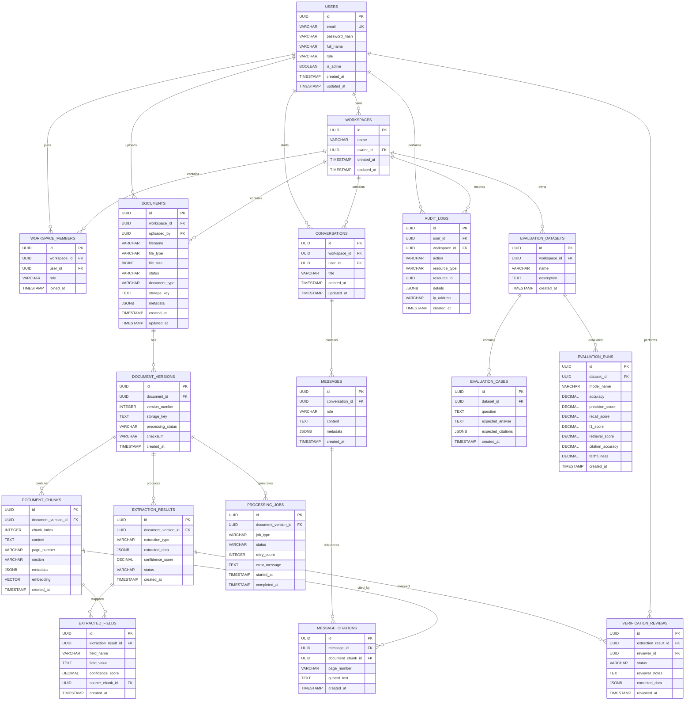

##  Database ER Diagram

DocuMind AI uses **PostgreSQL** as its primary relational database, with **pgvector** for storing and searching document embeddings.

The database is designed around four major concerns:

* **Identity & workspace management**
* **Document processing & structured extraction**
* **RAG conversations & citations**
* **Human verification, auditing & AI evaluation**

### 1 Entity Relationship Diagram



### 2 Core Database Structure

The database can be viewed as six interconnected domains:

```text
                         ┌──────────────┐
                         │    USERS     │
                         └──────┬───────┘
                                │
                                ↓
                       ┌────────────────┐
                       │   WORKSPACES   │
                       └───────┬────────┘
                               │
                ┌──────────────┼──────────────┐
                ↓              ↓              ↓
          ┌──────────┐   ┌────────────┐  ┌─────────────┐
          │ Documents│   │Conversations│  │ Audit Logs  │
          └────┬─────┘   └──────┬─────┘  └─────────────┘
               │                │
               ↓                ↓
        ┌──────────────┐    ┌──────────┐
        │   Versions   │    │ Messages │
        └──────┬───────┘    └────┬─────┘
               │                 │
        ┌──────┴────────┐        ↓
        ↓               ↓   ┌───────────┐
   ┌─────────┐    ┌──────────┐│ Citations │
   │ Chunks  │    │Extraction│└─────┬─────┘
   └────┬────┘    │ Results  │      │
        │         └────┬─────┘      │
        │              ↓            │
        │        ┌────────────┐     │
        │        │Verification│     │
        │        └────────────┘     │
        │                           │
        └───────────────────────────┘
```

### 3 User & Workspace Model

DocuMind AI uses **workspace-level isolation**.

A user can belong to multiple workspaces, while each workspace can contain multiple users.

```text
USER
 │
 ├── Workspace A
 │      ├── Admin
 │      ├── Member
 │      └── Documents
 │
 └── Workspace B
        ├── Owner
        ├── Viewer
        └── Documents
```

The `WORKSPACE_MEMBERS` table implements the many-to-many relationship:

```text
USERS
  │
  │ 1:N
  ↓
WORKSPACE_MEMBERS
  ↑
  │ N:1
  │
WORKSPACES
```

This enables role-based access such as:

| Role       | Permissions                          |
| ---------- | ------------------------------------ |
| **OWNER**  | Full workspace control               |
| **ADMIN**  | Manage users, documents and settings |
| **MEMBER** | Upload, search, process and chat     |
| **VIEWER** | Read-only access                     |

### 4 Document Data Model

Documents are separated from their individual versions.

```text
DOCUMENT
   │
   ├── Version 1
   │      ├── Chunks
   │      └── Extraction
   │
   ├── Version 2
   │      ├── Chunks
   │      └── Extraction
   │
   └── Version 3
          ├── Chunks
          └── Extraction
```

This allows DocuMind AI to preserve document history and later support **document comparison and version-aware RAG**.

### 5 RAG Data Model

The RAG system uses `DOCUMENT_CHUNKS` as the primary retrieval unit.

Each chunk contains:

* Extracted text.
* Document version.
* Page number.
* Section information.
* Structural metadata.
* Vector embedding.

```text
Document
    ↓
Document Version
    ↓
Semantic Chunks
    ↓
Embedding
    ↓
pgvector
```

The `embedding` field is stored using PostgreSQL's **pgvector** extension.

Conceptually:

```text
DOCUMENT_CHUNKS
┌─────────────────────────────────────┐
│ id                                  │
│ document_version_id                 │
│ content                             │
│ page_number                         │
│ section                             │
│ metadata                            │
│ embedding ──────────────→ pgvector  │
└─────────────────────────────────────┘
```

Keyword search can be performed through PostgreSQL full-text search, while semantic search uses pgvector.

Together they provide:

```text
Keyword Search
      +
Vector Search
      ↓
Hybrid Retrieval
      ↓
Reranking
```

### 6 Extraction & Confidence Model

Structured AI extraction is stored separately from the original document.

```text
DOCUMENT_VERSION
       ↓
EXTRACTION_RESULT
       ↓
EXTRACTED_FIELDS
       ↓
Source Chunk
```

For example:

```text
Extraction Result
│
├── Invoice Number
│     ├── Value: INV-2026-001
│     ├── Confidence: 0.98
│     └── Source: Chunk #14
│
├── Total Amount
│     ├── Value: ₹45,000
│     ├── Confidence: 0.94
│     └── Source: Chunk #18
│
└── Invoice Date
      ├── Value: 2026-08-15
      ├── Confidence: 0.97
      └── Source: Chunk #12
```

This allows confidence to be tracked at both:

* **Extraction-result level**
* **Individual-field level**

### 7 Conversation & Citation Model

Document conversations are associated with workspaces and users.

```text
Workspace
    ↓
Conversation
    ↓
Messages
    ↓
Message Citations
    ↓
Document Chunks
```

This creates an explicit relationship between an AI-generated answer and the document evidence supporting it.

For example:

```text
User Question
      ↓
AI Answer
      ↓
Citation
      ↓
Document Chunk
      ↓
Page / Section
```

Therefore, citations are not merely generated as text by the AI—they are represented as **database relationships**.

### 8 Human Verification Model

Low-confidence or sensitive extraction results can be sent for human verification.

```text
EXTRACTION_RESULT
       ↓
VERIFICATION_REVIEW
       ↓
Reviewer
       ↓
Corrected Data
       ↓
Approve / Reject
       ↓
AUDIT_LOG
```

The original AI-generated result is preserved, while the human correction is stored separately.

This provides traceability:

```text
AI Result
   ↓
Human Correction
   ↓
Final Decision
   ↓
Audit Record
```

### 9 Processing Jobs

Document processing is asynchronous.

The `PROCESSING_JOBS` table tracks background operations such as:

* File parsing.
* OCR.
* Layout analysis.
* AI extraction.
* Chunking.
* Embedding generation.
* Indexing.

Example lifecycle:

```text
QUEUED
  ↓
PROCESSING
  ↓
COMPLETED

       OR

PROCESSING
  ↓
FAILED
  ↓
RETRY
```

The database therefore maintains a persistent record of processing state independently from the Celery worker.

### 10 Auditability

Important system operations are recorded in `AUDIT_LOGS`.

Examples include:

```text
USER_LOGIN
DOCUMENT_UPLOADED
DOCUMENT_DELETED
DOCUMENT_ACCESSED
EXTRACTION_COMPLETED
VERIFICATION_STARTED
RESULT_APPROVED
RESULT_REJECTED
ROLE_CHANGED
WORKSPACE_UPDATED
```

Each audit record can contain:

* User.
* Workspace.
* Action.
* Resource type.
* Resource ID.
* Additional metadata.
* Timestamp.
* IP address where appropriate.

This supports security investigations, debugging and compliance-oriented workflows.

### 11 AI Evaluation Data Model

DocuMind AI maintains evaluation datasets separately from production conversations.

```text
Evaluation Dataset
       │
       ├── Evaluation Case 1
       ├── Evaluation Case 2
       ├── Evaluation Case 3
       └── ...
              ↓
        Evaluation Run
              ↓
      Quality Metrics
```

Evaluation cases can contain:

* Input question.
* Expected answer.
* Expected citations.
* Ground-truth information.

Evaluation runs can record metrics such as:

* Accuracy.
* Precision.
* Recall.
* F1.
* Retrieval Recall@K.
* MRR.
* Citation accuracy.
* Faithfulness.

This allows model and pipeline changes to be evaluated against a consistent benchmark.

### 412 Database Design Principles

The database follows these principles:

1. **Relational Integrity** — Foreign keys maintain relationships between entities.
2. **Workspace Isolation** — Workspace ownership and membership control data access.
3. **Version Preservation** — Document versions are retained independently.
4. **Evidence Traceability** — Extracted fields and answers can reference source chunks.
5. **Vector Search Support** — pgvector stores embeddings alongside relational metadata.
6. **Auditability** — Important operations are persisted in audit logs.
7. **Human Verification** — AI output and human corrections remain distinguishable.
8. **Asynchronous Processing** — Processing jobs have persistent lifecycle states.
9. **Evaluation Separation** — Benchmark data is separated from normal user conversations.
10. **Extensibility** — The schema can support additional document types, AI providers and extraction schemas.

### 13 Database Technology

| Component            | Technology            | Purpose                            |
| -------------------- | --------------------- | ---------------------------------- |
| **Primary Database** | PostgreSQL            | Relational application data        |
| **Vector Database**  | PostgreSQL + pgvector | Embeddings and semantic retrieval  |
| **Object Storage**   | S3 / MinIO            | Original and processed documents   |
| **Cache / Queue**    | Redis                 | Caching and asynchronous job queue |
| **ORM**              | SQLAlchemy            | Database access                    |
| **Migrations**       | Alembic               | Schema versioning                  |

### 14 Simplified Relationship Summary

```text
Users
  │
  ├──< Workspace Members >── Workspaces
  │                              │
  │                              ├──< Documents
  │                              │       │
  │                              │       └──< Document Versions
  │                              │               │
  │                              │               ├──< Chunks ──> Embeddings
  │                              │               ├──< Extractions
  │                              │               └──< Processing Jobs
  │                              │
  │                              ├──< Conversations
  │                              │       └──< Messages
  │                              │               └──< Citations >── Chunks
  │                              │
  │                              ├──< Evaluation Datasets
  │                              │       ├──< Evaluation Cases
  │                              │       └──< Evaluation Runs
  │                              │
  │                              └──< Audit Logs
  │
  └──< Verification Reviews >── Extraction Results
```

The resulting database provides the persistent foundation required for **secure multi-user document intelligence, RAG, citation tracking, human verification, document versioning, asynchronous processing and measurable AI evaluation**.
