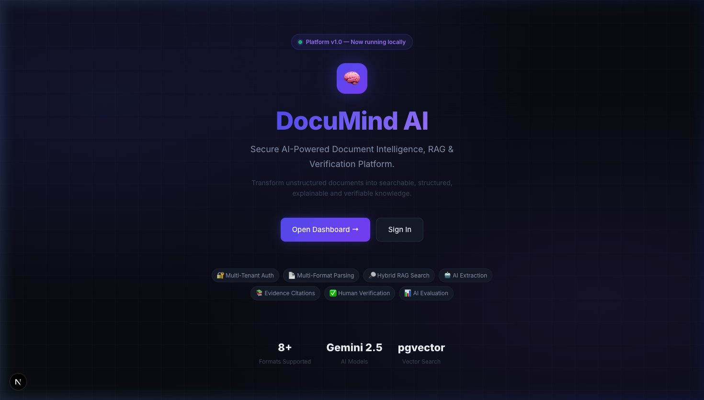
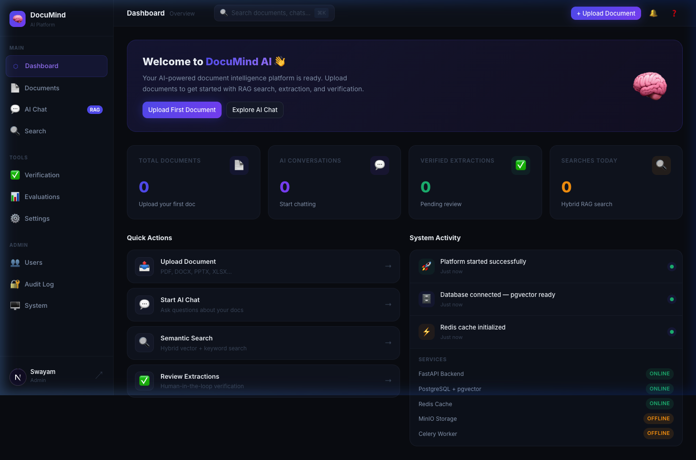
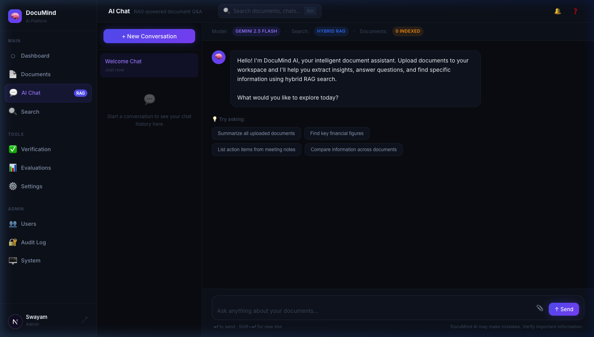
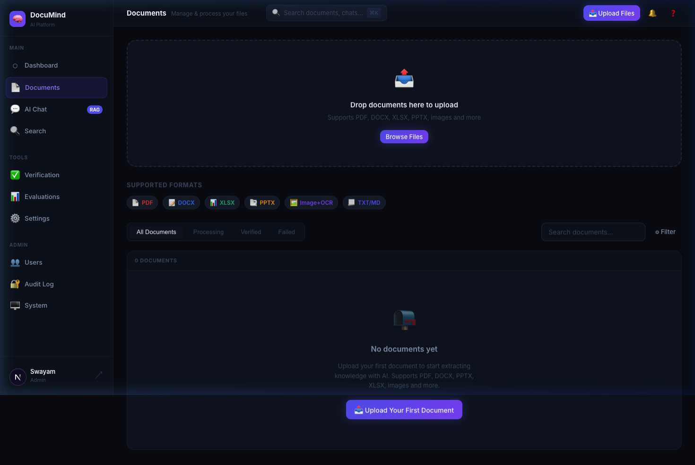
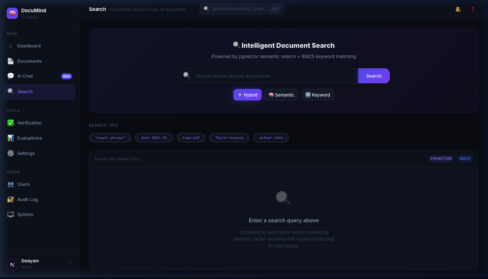
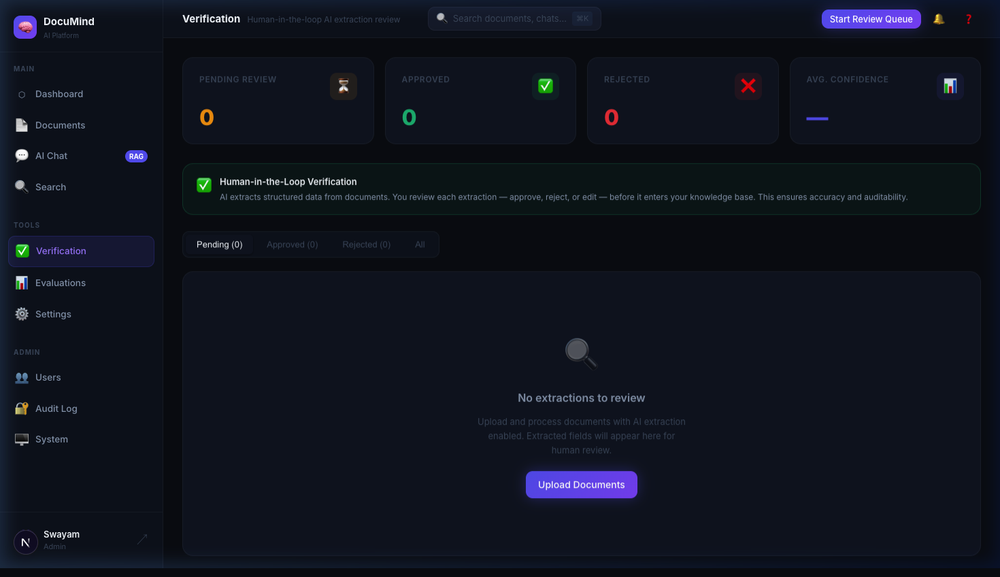
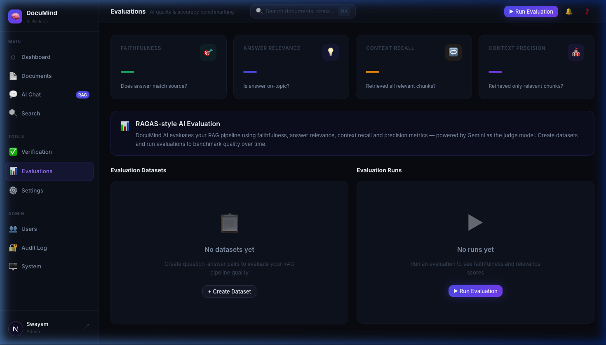
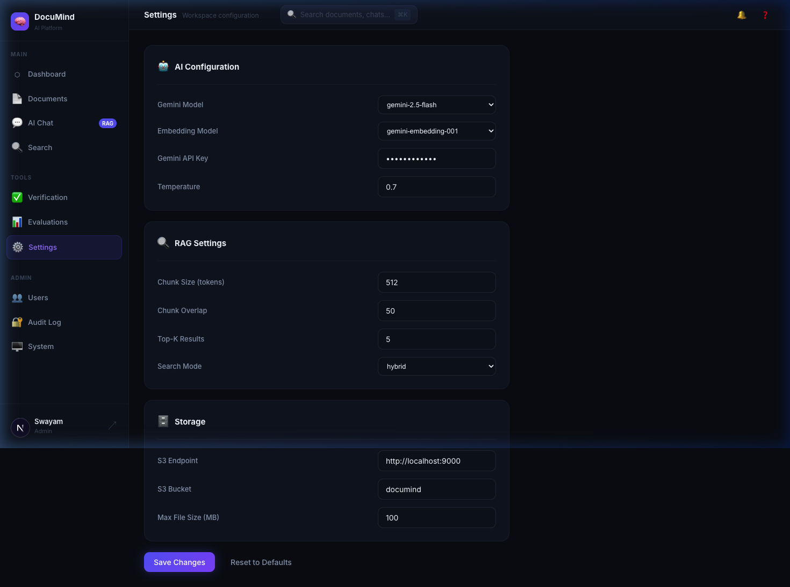
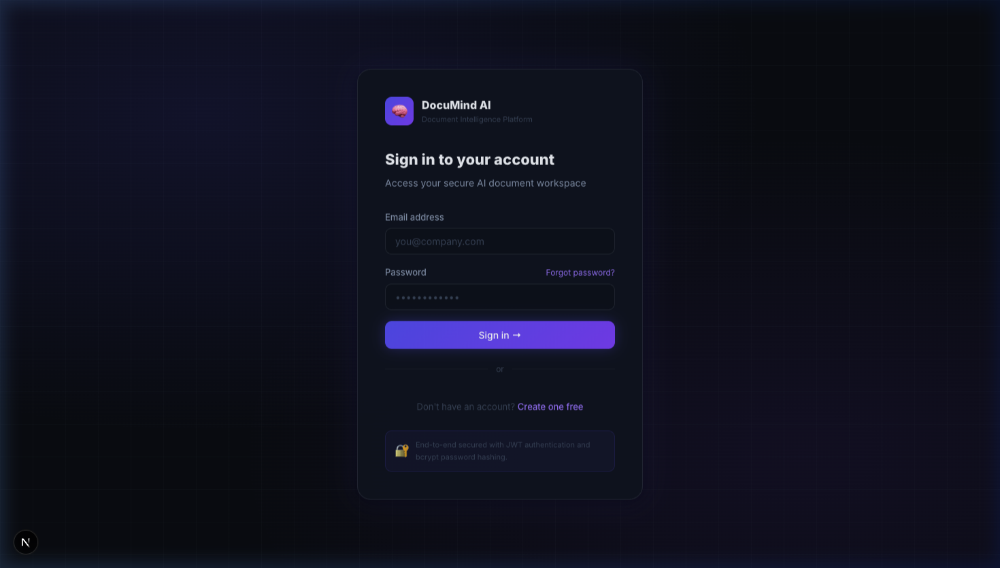

<p align="center">
  
</p>

<h1 align="center">🧠 DocuMind AI</h1>
<p align="center">
  <strong>Secure AI-Powered Document Intelligence, RAG & Verification Platform</strong>
</p>

<p align="center">
  
  
  
  
  
  
</p>

<p align="center">
  DocuMind AI transforms unstructured documents into searchable, structured, explainable and verifiable knowledge using multi-format parsing, OCR, RAG, hybrid search, AI extraction, citations, confidence scoring and human-in-the-loop verification.
</p>

---

## ✨ Features

| Feature | Description |
|---------|-------------|
| 🔐 **Multi-Tenant Auth** | JWT + bcrypt, RBAC with workspace isolation |
| 📄 **Multi-Format Parsing** | PDF, DOCX, XLSX, PPTX, images (OCR), TXT, MD |
| 🔎 **Hybrid RAG Search** | pgvector semantic search + BM25 keyword matching |
| 🤖 **AI Extraction** | Structured field extraction from documents with Gemini |
| 📚 **Evidence Citations** | Every AI answer grounded with source citations |
| ✅ **Human Verification** | Review & approve AI extractions before use |
| 📊 **AI Evaluation** | RAGAS-style faithfulness, relevance & recall metrics |
| ⚡ **Async Processing** | Celery workers with Redis for background document processing |
| 🗄 **Object Storage** | MinIO / S3-compatible file storage with signed URLs |

---

## 🖼 UI Screenshots

### 🏠 Landing Page


### 📊 Dashboard


### 💬 AI Chat (RAG)


### 📄 Documents


### 🔍 Semantic Search


### ✅ Verification


### 📊 AI Evaluations


### ⚙️ Settings


### 🔐 Login


---

## 🏗 Architecture

```
┌─────────────────────────────────────────────────────────┐
│                     Next.js Frontend                     │
│           (Dashboard · Chat · Docs · Search)             │
└─────────────────────────┬───────────────────────────────┘
                          │ REST API
┌─────────────────────────▼───────────────────────────────┐
│                   FastAPI Backend                        │
│         Auth · Documents · RAG · Extraction              │
└────┬────────────┬────────────┬────────────┬─────────────┘
     │            │            │            │
  Postgres     Redis        MinIO       Celery
  +pgvector    Cache       Storage      Worker
     │
  Vector DB
  (embeddings)
```

**AI Stack:** Google Gemini 2.5 Flash (generation) · Gemini Embedding 001 (vectors) · pgvector (ANN search)

---

## 🚀 Quick Start

### Option A — Docker (recommended)

```bash
# 1. Clone
git clone https://github.com/Swayam26-rwt/DocuMind-AI.git
cd DocuMind-AI

# 2. Configure
cp .env.example .env
# Edit .env and set GEMINI_API_KEY=your_key

# 3. Run
docker compose up --build
```

| Service | URL |
|---------|-----|
| Frontend | http://localhost:3000 |
| API | http://localhost:8000 |
| API Docs | http://localhost:8000/api/docs |
| MinIO Console | http://localhost:9001 |

### Option B — Native (no Docker)

**Prerequisites:** Python 3.13+, Node 18+, PostgreSQL 16+, Redis

```bash
# Install system deps (macOS)
brew install postgresql@16 redis pgvector
brew services start postgresql@16 redis

# Set up database
psql postgres -c "CREATE USER documind WITH PASSWORD 'documind';"
psql postgres -c "CREATE DATABASE documind OWNER documind;"
psql documind -c "CREATE EXTENSION IF NOT EXISTS vector;"

# Backend
cd backend
python3 -m venv .venv && source .venv/bin/activate
pip install -r requirements.txt
PYTHONPATH=. python3 -c "from app.db.base import Base; from app.db.session import engine; from app.models import *; Base.metadata.create_all(engine)"
PYTHONPATH=. uvicorn app.main:app --host 0.0.0.0 --port 8000 --reload

# Frontend (new terminal)
cd frontend
npm install
npm run dev
```

> ⚠️ Set `GEMINI_API_KEY` in `.env` for AI features (RAG, extraction, evaluation).  
> Get a free key at [aistudio.google.com](https://aistudio.google.com/app/apikey)

---

## 📁 Project Structure

```
DocuMind-AI/
├── backend/
│   ├── app/
│   │   ├── api/v1/        # REST endpoints
│   │   ├── ai/            # Gemini integration
│   │   ├── core/          # Config, security, auth
│   │   ├── db/            # SQLAlchemy session
│   │   ├── models/        # ORM models (18 tables)
│   │   ├── rag/           # RAG pipeline
│   │   ├── services/      # Business logic
│   │   ├── storage/       # MinIO/S3 integration
│   │   └── workers/       # Celery tasks
│   └── requirements.txt
├── frontend/
│   └── src/
│       ├── app/           # Next.js App Router pages
│       ├── components/    # Reusable UI components
│       ├── hooks/         # React hooks
│       ├── services/      # API client layer
│       └── types/         # TypeScript types
├── docs/
│   └── screenshots/       # UI screenshots
├── docker-compose.yml
└── .env.example
```

---

## 🔧 Environment Variables

| Variable | Default | Description |
|----------|---------|-------------|
| `GEMINI_API_KEY` | — | **Required** for AI features |
| `GEMINI_MODEL` | `gemini-2.5-flash` | Generation model |
| `EMBEDDING_MODEL` | `gemini-embedding-001` | Embedding model |
| `DATABASE_URL` | `postgresql+psycopg://...` | Postgres connection |
| `REDIS_URL` | `redis://redis:6379/0` | Redis connection |
| `SECRET_KEY` | — | JWT signing key |
| `S3_ENDPOINT` | `http://minio:9000` | Object storage |

---

## 🧪 Testing

```bash
# Backend tests
cd backend && pytest

# Frontend type check
cd frontend && npx tsc --noEmit
```

---

## 📄 License

MIT © Swayam
