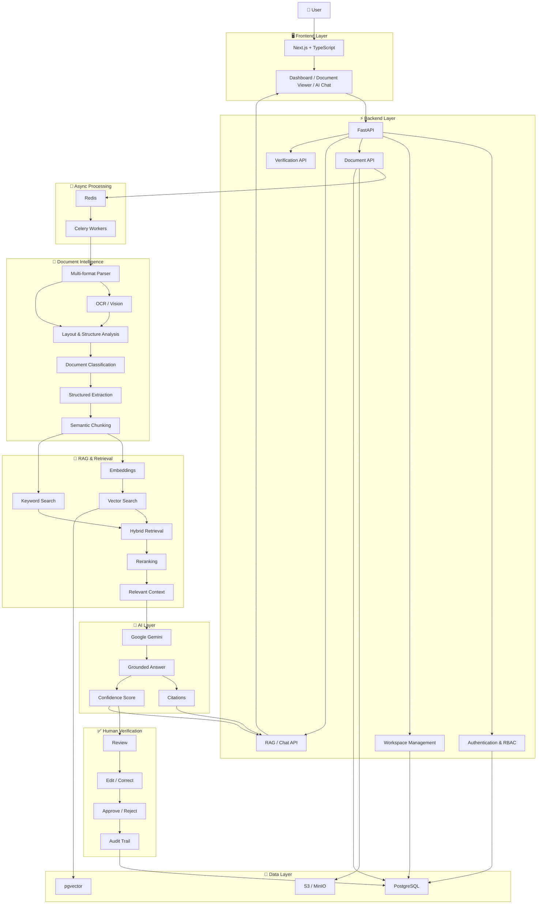
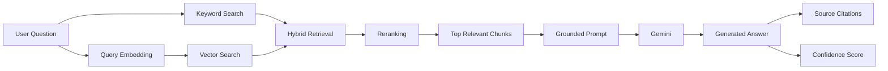

## 3. System Architecture

DocuMind AI follows a **secure, modular, asynchronous full-stack architecture** designed for multi-format document processing, AI-powered information extraction, Retrieval-Augmented Generation (RAG), hybrid search, citation-based answers, confidence scoring, and human verification.

The system is designed as a **modular monolith with background workers**, providing strong separation of responsibilities while avoiding the operational complexity of premature microservices.

### 3.1 High-Level Architecture



### 3.2 Architecture Layers

| Layer                   | Technologies                                        | Responsibility                                                        |
| ----------------------- | --------------------------------------------------- | --------------------------------------------------------------------- |
| **Presentation Layer**  | Next.js, TypeScript, Tailwind CSS                   | UI, dashboard, document viewer, search and chat                       |
| **API Layer**           | FastAPI, Pydantic                                   | REST APIs, validation, business logic                                 |
| **Security Layer**      | JWT/session, RBAC, password hashing                 | Authentication and authorization                                      |
| **Async Processing**    | Redis, Celery                                       | Background document-processing jobs                                   |
| **Document Processing** | PyMuPDF, python-docx, python-pptx, openpyxl, Pandas | Multi-format document parsing                                         |
| **OCR/Vision**          | OCR + Vision models                                 | Scanned documents and visual content                                  |
| **AI Processing**       | Google Gemini                                       | Extraction, classification, summarization, translation and generation |
| **RAG Layer**           | Embeddings, pgvector                                | Semantic retrieval and knowledge grounding                            |
| **Search Layer**        | PostgreSQL FTS + vector search                      | Hybrid keyword + semantic search                                      |
| **Storage Layer**       | PostgreSQL, S3/MinIO                                | Metadata, structured data and original files                          |
| **Verification Layer**  | FastAPI + frontend workflows                        | Human review and approval                                             |
| **Evaluation Layer**    | Custom evaluation pipeline                          | AI quality and retrieval evaluation                                   |

### 3.3 Document Processing Pipeline

When a user uploads a document, it passes through an asynchronous processing pipeline:

```text
Upload
   ↓
File Validation
   ↓
Secure Object Storage
   ↓
Processing Queue
   ↓
Format Detection
   ↓
Document Parser
   ↓
OCR / Vision (if required)
   ↓
Layout & Structure Analysis
   ↓
Document Classification
   ↓
Structured Information Extraction
   ↓
Semantic Chunking
   ↓
Embedding Generation
   ↓
Vector + Keyword Indexing
   ↓
READY
```

The document lifecycle is represented as:

```text
UPLOADED
    ↓
QUEUED
    ↓
PROCESSING
    ↓
EXTRACTED
    ↓
INDEXING
    ↓
READY

Processing Failure
    ↓
FAILED
    ↓
RETRY
```

### 3.4 RAG Architecture

DocuMind AI uses **Retrieval-Augmented Generation (RAG)** to prevent the AI model from relying solely on its internal knowledge.



The retrieval process combines:

* **Semantic/vector search** for conceptual similarity.
* **Keyword/full-text search** for exact terms, identifiers and numbers.
* **Hybrid retrieval** to combine both signals.
* **Reranking** to improve the relevance of retrieved chunks.
* **Context grounding** before sending information to the AI model.

### 3.5 Hybrid Search

DocuMind AI does not depend exclusively on vector similarity.

```text
                    User Query
                        │
             ┌──────────┴──────────┐
             ↓                     ↓
       Keyword Search        Vector Search
             │                     │
             └──────────┬──────────┘
                        ↓
                 Hybrid Retrieval
                        ↓
                    Reranking
                        ↓
              Relevant Document Chunks
```

This approach is particularly useful for documents containing:

* Names
* Invoice numbers
* Contract clauses
* Dates
* Product IDs
* Technical terminology
* Exact numerical values

### 3.6 AI Answer Generation

The AI generation pipeline follows an evidence-first approach:

```text
User Question
      ↓
Retrieve Evidence
      ↓
Rerank Evidence
      ↓
Build Grounded Context
      ↓
Send Context + Question to Gemini
      ↓
Generate Answer
      ↓
Attach Citations
      ↓
Calculate Confidence
      ↓
Return Result
```

If sufficient evidence cannot be retrieved, the system should **not fabricate an answer**. It should explicitly indicate that the available documents do not contain sufficient evidence.

### 3.7 Citation Architecture

Every RAG-generated answer should maintain a connection to its supporting evidence.

A citation can contain:

```text
Document
   ├── Page
   ├── Section
   ├── Chunk ID
   └── Source Text
```

Example:

```text
Answer:
The contract expires on 31 December 2027.

Source:
📄 Employment_Contract.pdf
📍 Page 8
📑 Section: Term and Termination
```

This makes the system more **explainable, auditable and trustworthy**.

### 3.8 Confidence & Verification

Confidence scoring is used to identify results that may require human review.

```text
AI Extraction
     ↓
Confidence Assessment
     ↓
 ┌───────────────┐
 │ High Confidence│ ──→ Accept
 └───────────────┘

 ┌────────────────┐
 │ Low Confidence │ ──→ Human Review
 └────────────────┘
                         ↓
                    Edit / Correct
                         ↓
                    Approve / Reject
                         ↓
                     Audit Trail
```

Confidence should ideally be derived from measurable signals such as:

* Evidence availability.
* Retrieval relevance.
* Agreement between extraction methods.
* Schema validation.
* Source consistency.
* Historical evaluation performance.

The system should avoid treating an arbitrary LLM-generated percentage as a reliable confidence measurement.

### 3.9 Data Architecture

DocuMind AI separates application data, vector data and document files.

```text
                DocuMind AI
                     │
          ┌──────────┼──────────┐
          ↓          ↓          ↓
     PostgreSQL   pgvector   S3 / MinIO
          │          │          │
          │          │          └── Original Files
          │          │
          │          └───────────── Embeddings
          │
          ├── Users
          ├── Workspaces
          ├── Documents
          ├── Metadata
          ├── Conversations
          ├── AI Results
          └── Audit Records
```

### 3.10 Security Architecture

Security is enforced primarily on the server side.

```text
Client
  ↓ HTTPS
FastAPI
  ↓
Authentication
  ↓
Authorization / RBAC
  ↓
Workspace Isolation
  ↓
Validated Operation
  ↓
Database / Storage / AI Services
```

Security controls include:

* Server-side API credentials.
* Secure authentication.
* Role-based access control.
* Workspace-level data isolation.
* Password hashing using Argon2id or bcrypt.
* Secure file validation.
* File-size and type restrictions.
* Rate limiting.
* HTTPS/TLS.
* Encryption at rest where supported.
* Audit logging.
* Prompt-injection defenses.
* Protection against unauthorized document access.

Uploaded documents are treated as **untrusted data** and must not be allowed to override system instructions or security policies.

### 3.11 Scalability

Heavy document-processing operations are handled asynchronously.

```text
                    API Server
                        │
                        ↓
                      Redis
                        │
                        ↓
                 Celery Workers
                ┌───────┼───────┐
                ↓       ↓       ↓
              PDF     DOCX    XLSX
             Worker   Worker  Worker
```

This prevents large documents or expensive AI operations from blocking normal API requests.

The architecture can later scale individual components independently:

```text
Frontend
    ↓
Load Balancer
    ↓
FastAPI Instances
    ↓
Redis / Queue
    ↓
Multiple Processing Workers
    ↓
PostgreSQL + pgvector
    ↓
Object Storage
```

### 3.12 Reliability & Observability

The platform should track:

* API response latency.
* Document-processing latency.
* Queue length.
* Failed processing jobs.
* Retry counts.
* AI request latency.
* Token usage.
* AI errors.
* Database performance.
* Vector-search performance.
* Storage usage.
* Authentication failures.

The system should use structured logging, metrics and distributed tracing where appropriate.

### 3.13 Architectural Principles

DocuMind AI is built around the following principles:

1. **Security First** — Sensitive operations and credentials remain server-side.
2. **Evidence First** — AI responses should be grounded in retrieved document evidence.
3. **Human in the Loop** — Low-confidence results can be reviewed and corrected.
4. **Async by Design** — Expensive document processing runs as background jobs.
5. **Multi-format Native** — Different document formats receive format-aware processing.
6. **Explainability** — Answers should expose their supporting sources.
7. **Auditability** — Important AI and human decisions are recorded.
8. **Modularity** — Components are separated by responsibility.
9. **Measurability** — AI quality is evaluated using defined metrics.
10. **Scalable by Evolution** — Start with a modular monolith and extract services only when justified by scale.

### 3.14 Recommended Deployment Architecture

```text
                         Internet
                            │
                            ↓
                    ┌──────────────┐
                    │ Load Balancer│
                    └──────┬───────┘
                           │
              ┌────────────┴────────────┐
              ↓                         ↓
       Next.js Frontend            FastAPI Backend
                                        │
                           ┌────────────┼────────────┐
                           ↓            ↓            ↓
                        Redis       PostgreSQL    S3/MinIO
                           │            │
                           ↓            ↓
                    Celery Workers   pgvector
                           │
                           ↓
                    AI / OCR Services
                           │
                           ↓
                         Gemini
```

### 3.15 Why This Architecture?

The architecture addresses the major limitations of a client-side document parser by introducing:

| Prototype Limitation        | DocuMind AI Solution          |
| --------------------------- | ----------------------------- |
| API key exposed in browser  | Server-side AI integration    |
| Local-only history          | PostgreSQL persistence        |
| Limited document processing | Dedicated processing pipeline |
| Browser memory limitations  | Asynchronous workers          |
| No persistent RAG           | PostgreSQL + pgvector         |
| Vector-only retrieval       | Hybrid search                 |
| Unsupported AI claims       | Source citations              |
| Unreliable confidence       | Evidence-based confidence     |
| No verification             | Human-in-the-loop workflow    |
| No access control           | Authentication + RBAC         |
| No auditability             | Audit trail                   |
| No AI quality measurement   | Evaluation framework          |
| No scalable architecture    | Queue-based processing        |
| No observability            | Logs, metrics and tracing     |

### 3.16 Architectural Summary

The complete DocuMind AI architecture can be summarized as:

```text
User
 ↓
Next.js Frontend
 ↓
FastAPI Backend
 ↓
Authentication + RBAC
 ↓
Secure Upload
 ↓
S3 / MinIO
 ↓
Redis + Celery
 ↓
Multi-format Parsing
 ↓
OCR + Layout Analysis
 ↓
Structured Document
 ↓
Semantic Chunking
 ↓
Embeddings
 ↓
PostgreSQL + pgvector
 ↓
Hybrid Search
 ↓
Reranking
 ↓
Relevant Evidence
 ↓
Gemini
 ↓
Grounded Answer
 ↓
Citations + Confidence
 ↓
Human Verification
 ↓
Verified Result
 ↓
User
```

This architecture provides the foundation for building DocuMind AI as a **production-oriented document intelligence platform rather than a browser-only document parser**.
